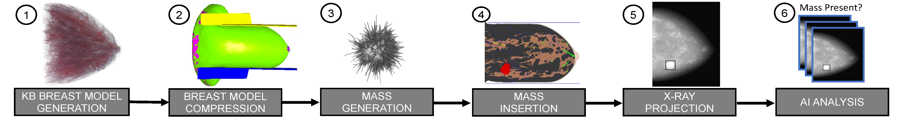

# Knowledge-based in silico models and dataset for the comparative evaluation of mammography AI for a range of breast characteristics, lesion conspicuities and doses

**This repository contains code used in the paper:**

"_Knowledge-based in silico models and dataset for the comparative evaluation of mammography AI for a range of breast characteristics, lesion conspicuities and doses_"

[Elena Sizikova](https://esizikova.github.io/), [Niloufar Saharkhiz](https://www.linkedin.com/in/niloufar-saharkhiz/), [Diksha Sharma](https://www.linkedin.com/in/diksha-sharma-6059977/), [Miguel Lago](https://www.linkedin.com/in/milaan/), [Berkman Sahiner](https://www.linkedin.com/in/berkman-sahiner-6aa9a919/), [Jana Gut Delfino](https://www.linkedin.com/in/janadelfino/), [Aldo Badano](https://www.linkedin.com/in/aldobadano/)

NeurIPS Datasets and Benchmarks Track 2023. 



The contributions of our work are:
* We demonstrate that, using this approach, we can detect differences in AI model performance based on selected image acquisition device or physical object model parameters. Specifically, we evaluate the effect of image acquisition (radiation dose) and object model (breast and mass densities, mass size) parameters on the performance of the AI model.
* We release a synthetic dataset, M-SYNTH, to facilitate testing with pre-computed data using the proposed pipeline. The dataset consists of 1,200 stochastic knowledge-based (KB) models and their associated digital mammography (DM) images with varying physical (breast density, mass size and density) and imaging (dose) characteristics.

## Regulatory Science Tool (RST) Reference
* RST Reference Number: RST24AI06.01
* Date of Publication: July 1, 2024
* Recommended Citation: U.S. Food and Drug Administration (2024). _M-SYNTH: A Dataset for the Comparative Evaluation of Mammography AI_ (RST24AI06.01). https://cdrh-rst.fda.gov/m-synth-dataset-comparative-evaluation-mammography-ai

## For More Information:
* [Catalog of Regulatory Science Tools to Help Assess New Medical Devices](https://www.fda.gov/medical-devices/science-and-research-medical-devices/catalog-regulatory-science-tools-help-assess-new-medical-devices) 


####
**Disclaimer**
<br>

***About the Catalog of Regulatory Science Tools*** 
<br>
<sub>
The enclosed tool is part of the Catalog of Regulatory Science Tools, which provides a peer-reviewed resource for stakeholders to use where standards and qualified Medical Device Development Tools (MDDTs) do not yet exist. These tools do not replace FDA-recognized standards or MDDTs. This catalog collates a variety of regulatory science tools that the FDA's Center for Devices and Radiological Health's (CDRH) Office of Science and Engineering Labs (OSEL) developed. These tools use the most innovative science to support medical device development and patient access to safe and effective medical devices. If you are considering using a tool from this catalog in your marketing submissions, note that these tools have not been qualified as [Medical Device Development Tools](https://www.fda.gov/medical-devices/medical-device-development-tools-mddt) and the FDA has not evaluated the suitability of these tools within any specific context of use. You may [request feedback or meetings for medical device submissions](https://www.fda.gov/regulatory-information/search-fda-guidance-documents/requests-feedback-and-meetings-medical-device-submissions-q-submission-program) as part of the Q-Submission Program. 
</sub>
<br><br>
<sub>
For more information about the Catalog of Regulatory Science Tools, email OSEL_CDRH@fda.hhs.gov.  
</sub>
<br><br>
<sub>
This software and documentation (the "Software") were developed at the Food and Drug Administration (FDA) by employees of the Federal Government in the course of their
official duties. Pursuant to Title 17, Section 105 of the United States Code, this work is not subject to copyright protection and is in the public domain. Permission
is hereby granted, free of charge, to any person obtaining a copy of the Software, to deal in the Software without restriction, including without limitation the rights
to use, copy, modify, merge, publish, distribute, sublicense, or sell copies of the Software or derivatives, and to permit persons to whom the Software is furnished to
do so. FDA assumes no responsibility whatsoever for use by other parties of the Software, its source code, documentation or compiled executables, and makes no
guarantees, expressed or implied, about its quality, reliability, or any other characteristic. Further, use of this code in no way implies endorsement by the FDA or
confers any advantage in regulatory decisions. Although this software can be redistributed and/or modified freely, we ask that any derivative works bear some notice
that they are derived from it, and any modified versions bear some notice that they have been modified.
</sub>

## Table of Contents
1. Dataset
2. Code
3. Citation
4. Disclaimer

## Dataset
M-SYNTH is a synthetic digital mammography (DM) dataset with four breast fibroglandular density distributions imaged using Monte Carlo x-ray simulations with the publicly available [Virtual Imaging Clinical Trial for Regulatory Evaluation (VICTRE)](https://github.com/DIDSR/VICTRE) toolkit. The dataset has the following characteristics:

* Breast density: dense, hetero, scattered, fatty
* Mass radius (mm): 5.00, 7.00, 9.00
* Mass density: 1.0, 1.01, 1.1
* Relative dose: 20%, 40%, 60%, 80%, 100% of the clinically recommended dose for each density
<p align="center">

</p>

 M-SYNTH contains mammography images (in .raw and DICOM formats), metadata (breast density, mass radius, mass density, relative dose, detector) and coordinate locations of the lesion.

**New!** We also released pixel-level segmentation masks generated using VICTRE.  

Dataset is hosted on huggingface and can be downloaded at: [https://huggingface.co/datasets/didsr/msynth](https://huggingface.co/datasets/didsr/msynth)

## Code 
1. Code to show sample preprocessing, model training and inference steps is available in `code` directory.
2. Sample code to generate a single synthetic DM image with annotations and segmentation can be found in the following [VICTRE example](https://github.com/DIDSR/VICTRE_PIPELINE/tree/main/examples/msynth).
3. Examples of how to load .raw and .dcm images, obtain lesion locations and lesion segmentations can be found in the ```examples/``` folder.
   
## Citation
```
@article{sizikova2023knowledge,
  title={Knowledge-based in silico models and dataset for the comparative evaluation of mammography AI for a range of breast characteristics, lesion conspicuities and doses},
  author={Sizikova, Elena and Saharkhiz, Niloufar and Sharma, Diksha and Lago, Miguel and Sahiner, Berkman and Delfino, Jana G. and Badano, Aldo},
  journal={Advances in Neural Information Processing Systems},
  volume={},
  pages={16764--16778},
  year={2023}
}
```
## Related Links
1. [Virtual Imaging Clinical Trial for Regulatory Evaluation (VICTRE)](https://www.fda.gov/medical-devices/science-and-research-medical-devices/victre-silico-breast-imaging-pipeline).
2. [FDA Catalog of Regulatory Science Tools to Help Assess New Medical Device](https://www.fda.gov/medical-devices/science-and-research-medical-devices/catalog-regulatory-science-tools-help-assess-new-medical-devices).
3. A. Badano, C. G. Graff, A. Badal, D. Sharma, R. Zeng, F. W. Samuelson, S. Glick, K. J. Myers. [Evaluation of Digital Breast Tomosynthesis as Replacement of Full-Field Digital Mammography Using an In Silico Imaging Trial](http://dx.doi.org/10.1001/jamanetworkopen.2018.5474). JAMA Network Open 2018.
4. A. Badano, M. Lago, E. Sizikova, J. G. Delfino, S. Guan, M. A. Anastasio, B. Sahiner. [The stochastic digital human is now enrolling for in silico imaging trials—methods and tools for generating digital cohorts.](http://dx.doi.org/10.1088/2516-1091/ad04c0) Progress in Biomedical Engineering 2023.   
5. E. Sizikova, N. Saharkhiz, D. Sharma, M. Lago, B. Sahiner, J. G. Delfino, A. Badano. [Knowledge-based in silico models and dataset for the comparative evaluation of mammography AI](https://github.com/DIDSR/msynth-release). NeurIPS 2023 Workshop on Synthetic Data Generation with Generative AI.


